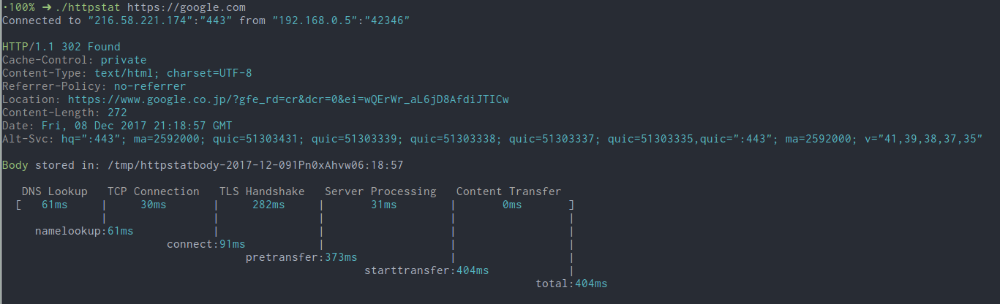

# httpstat



## Build
```
nimble build
```

## Install
```
nimble install
```

## Usage
```
$ ./httpstat --help

  Usage: httpstat URL [CURL_OPTIONS]
         httpstat -h | --help
         httpstat --version
  Arguments:
    URL     url to request, could be with or without `http(s)://` prefix
  Options:
    CURL_OPTIONS  any curl supported options, except for -w -D -o -S -s,
                  which are already used internally.
    -h --help     show this screen.
    -v --version     show version.
  Environments:
    HTTPSTAT_SHOW_BODY    Set to `true` to show response body in the output,
                          note that body length is limited to 1023 bytes, will be
                          truncated if exceeds. Default is `false`.
    HTTPSTAT_SHOW_IP      By default httpstat shows remote and local IP/port address.
                          Set to `false` to disable this feature. Default is `true`.
    HTTPSTAT_SHOW_SPEED   Set to `true` to show download and upload speed.
                          Default is `false`.
    HTTPSTAT_SAVE_BODY    By default httpstat stores body in a tmp file,
                          set to `false` to disable this feature. Default is `true`
    HTTPSTAT_CURL_BIN     Indicate the curl bin path to use. Default is `curl`
                          from current shell $PATH.
```

 simple :)
```
$ httpstat https://nim-lang.org/
```

## Implementation
- https://github.com/reorx/httpstat
- https://github.com/davecheney/httpstat
- https://github.com/yosuke-furukawa/httpstat
- https://github.com/tcnksm/go-httpstat
- https://github.com/b4b4r07/httpstat
- https://github.com/upamune/httpstat

## Author
taichi uchihara (@u_chi_ha_ra_)

## License
MIT
